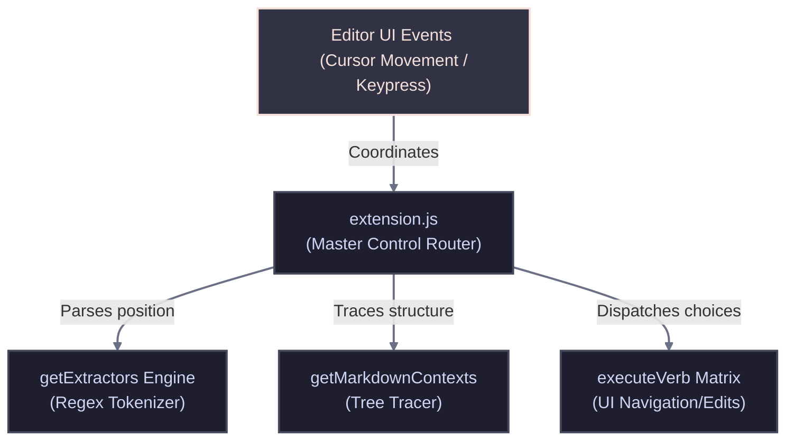

<!-- TEMPLATE: MANUAL.template.md -->
<!-- MANUAL Any text bounded by double curly braces like this is a placeholder for you to fill out. Replace those placeholders with real paths, rules, and project constraints. INSTRUCTIONS FOR THE AI AGENT: This file is the developer's handbook. It maps structural topologies, data flow, core algorithms, algebraic formulas, configuration guidelines, and technical specifications. -->
<!-- markdownlint-disable MD013 -->

# MANUAL

<!-- TOC location -->
## 🔍 Table of Contents
<!-- Maintained by script -->
- [MANUAL](#a-manual)  ^toc-manual
  - [📑 AI Primary Files](#a-aiprimaryfiles)  ^toc-aiprimaryfiles
  - [📥 Installation & Initial Deployment](#a-installationinitialdeployment)  ^toc-installationinitialdeployment
    - [Setup Sequence](#a-setupsequence)  ^toc-setupsequence
  - [🏗️ 1. Architecture Overview](#a-1architectureoverview)  ^toc-1architectureoverview
  - [🧠 2. Core Modules & Systems](#a-2coremodulessystems)  ^toc-2coremodulessystems
  - [🔎 3. Core Algorithm & Mathematical Formulas](#a-3corealgorithmmathematicalformulas)  ^toc-3corealgorithmmathematicalformulas
  - [🛰️ 4. Commands, Keybindings & Context Flags](#a-4commandskeybindingscontextflags)  ^toc-4commandskeybindingscontextflags
  - [🔧 5. Workspace Build & Configuration](#a-5workspacebuildconfiguration)  ^toc-5workspacebuildconfiguration
  - [🔍 Diagnostics & Common Troubleshooting](#a-diagnosticscommontroubleshooting)  ^toc-diagnosticscommontroubleshooting
    - [Known Failure States & Remediations](#a-knownfailurestatesremediations)  ^toc-knownfailurestatesremediations
      - [🚨 Symptom: "No valid target token found warnings on identifier search"](#a-symptomnovalidtargettokenfoundwarningsonidentifiersearch)  ^toc-symptomnovalidtargettokenfoundwarningsonidentifiersearch
      - [🚨 Symptom: "The Markdown hierarchy tree displays root inside valid document layers"](#a-symptomthemarkdownhierarchytreedisplaysrootinsidevaliddocumentlayers)  ^toc-symptomthemarkdownhierarchytreedisplaysrootinsidevaliddocumentlayers
  - [🚀 Go to...](#a-goto)  ^toc-goto

[TOC](#toc-manual)

## 📑 AI Primary Files
[TOC](#toc-aiprimaryfiles)
- 🔹 [AGENTS.md](../AGENTS.md)
- 🔹 [ARCHIVE.md](ARCHIVE.md)
- 🔹 [BUILD.md](BUILD.md)
- 🔹 [CODE.md](CODE.md)
- 🔹 [DESIGN.md](DESIGN.md)
- 🔹 [FEATURES.md](FEATURES.md)
- 🔹 [LOG.md](LOG.md)
- 🔸 [MANUAL.md](MANUAL.md)
- 🔹 [README.md](../README.md)
- 🔹 [SPEC.md](SPEC.md)
- 🔹 [TASKS.md](TASKS.md)
- 🔹 [TERMS.md](TERMS.md)
- 🔹 [TESTING.md](TESTING.md)
- 🔹 [VERSIONS.md](VERSIONS.md)

---

---

## 📥 Installation & Initial Deployment
[TOC](#toc-installationinitialdeployment)

### Setup Sequence
[TOC](#toc-setupsequence)
- 1. **Compile/Build Assets:** Package the system assets into a standalone extension bundle by running `npx vsce package`.
- 2. **Apply Configurations:** Install the generated `.vsix` bundle manually into your host environment using the VS Code CLI: `code --install-extension ptsd-0.0.1.vsix`.
- 3. **Register Components:** Reload the editor workspace window to activate the automated command registry mappings and hover hooks.

---

## 🏗️ 1. Architecture Overview
[TOC](#toc-1architectureoverview)

The extension utilizes an event-driven command registration pattern. Moving the cursor or triggering commands invokes the tokenizer backend, which parses document text arrays and pushes results down to presentation overlays.

---

## 🧠 2. Core Modules & Systems
[TOC](#toc-2coremodulessystems)

- **Positional Token Extractor (`getExtractors`)**: Stateless scanner invoked when selecting a target coordinate. It measures structural token scopes and checks boundary lengths to isolate active strings under the cursor.
- **Markdown Hierarchical Tracer (`getMarkdownContexts`)**: Scans backward line-by-line to parse structural headers, tracking heading indentation layers to build breadcrumb paths.
- **Dynamic Interaction Router (`executeVerb`)**: Handles UI view shifts. It launches QuickPick overlays, handles real-time list filtering, scrolls editor views, and applies buffer string modifications.

---

## 🔎 3. Core Algorithm & Mathematical Formulas
[TOC](#toc-3corealgorithmmathematicalformulas)

- **Container Narrowest Selection Matrix**: Finding the deepest nested bracket/quote utilizes line character position ranges to track character boundaries.

  $$\text{matchLength} = \text{endIdx} - \text{startIdx}$$

  $$\text{narrowestLength} = \min(\text{narrowestLength}, \text{matchLength})$$

- **Algorithmic Logic Sequence**:
  1. Capture active row string and cursor index parameter $C_{\text{idx}}$.
  2. Map container arrays; reject index pairs where $C_{\text{idx}} < \text{startIdx}$ or $C_{\text{idx}} > \text{endIdx} + 1$.
  3. Sort and slice the string array to return the smallest bounding content layer.

---

## 🛰️ 4. Commands, Keybindings & Context Flags
[TOC](#toc-4commandskeybindingscontextflags)

- **`ptsd.orchestrate`**:
  - **Purpose**: Launches the master dual-picker workflow.
  - **Scope**: Step 1 selects the extraction scope; Step 2 prompts the navigation action.
- **`ptsd.search.[type]`**:
  - **Purpose**: Standalone direct-access command loops bypassing Step 1 selection.
  - **Valid Types**: `lineExact`, `lineWithin`, `quoted`, `identifier`, `word`.
- **`ptsd.[type].[verb]`**:
  - **Purpose**: Direct keybinding combo map bypassing all menus.
  - **Valid Verbs**: `browse`, `next`, `prev`, `copy`, `inject`.

---

## 🔧 5. Workspace Build & Configuration
[TOC](#toc-5workspacebuildconfiguration)

- **`package.json` configurations:**
  - **Purpose**: Defines system properties and activation scopes.
  - **Format**: JSON object array.
  - **Details**: Contains standard contribution schemas mapping extension command identifiers directly to user workspace keybindings.

---

## 🔍 Diagnostics & Common Troubleshooting
[TOC](#toc-diagnosticscommontroubleshooting)

### Known Failure States & Remediations
[TOC](#toc-knownfailurestatesremediations)

#### 🚨 Symptom: "No valid target token found warnings on identifier search"
[TOC](#toc-symptomnovalidtargettokenfoundwarningsonidentifiersearch)
- **Root Cause:** The cursor is hovering over white space or non-standard alphanumeric character streams that do not match the expected identifier format.
- **Remediation:** Move your cursor back within a standard object path property name before executing the command picker.

#### 🚨 Symptom: "The Markdown hierarchy tree displays root inside valid document layers"
[TOC](#toc-symptomthemarkdownhierarchytreedisplaysrootinsidevaliddocumentlayers)
- **Root Cause:** Heading structures are missing space dividers after the leading symbols (e.g., using `##Heading` instead of `## Heading`).
- **Remediation:** Format headers with a space divider after the leading `#` symbols so the regex parser can track them.

---

## 🚀 Go to...
[TOC](#toc-goto)
- 🔹 [AGENTS.md](../AGENTS.md)
- 🔹 [ARCHIVE.md](ARCHIVE.md)
- 🔹 [BUILD.md](BUILD.md)
- 🔹 [CODE.md](CODE.md)
- 🔹 [DESIGN.md](DESIGN.md)
- 🔹 [FEATURES.md](FEATURES.md)
- 🔹 [LOG.md](LOG.md)
- 🔸 [MANUAL.md](MANUAL.md)
- 🔹 [README.md](../README.md)
- 🔹 [SPEC.md](SPEC.md)
- 🔹 [TASKS.md](TASKS.md)
- 🔹 [TERMS.md](TERMS.md)
- 🔹 [TESTING.md](TESTING.md)
- 🔹 [VERSIONS.md](VERSIONS.md)
<!-- TEMPLATE: MANUAL.template.md -->
